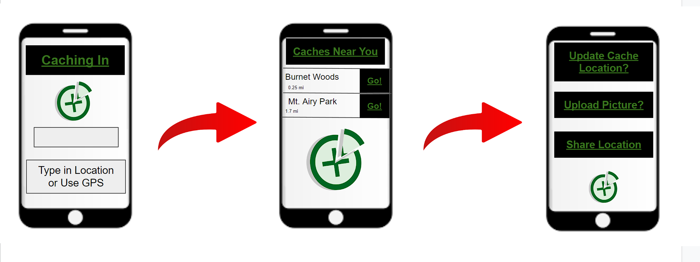

# CachingInApp – Microservices with IntelliJ IDEA 

## Introduction 

Caching In will allow geocachers to view a list of local cache points that are close to them or close to an area that they are going to. They will be able to see the points on a map. They can upload photos and add notes to cache points. 

## Storyboard 

## Requirements 

As a geocacher, I want to be able to see a list of cache points that I can navigate to. 

### Example 

  

**Given**: A feed of geocache points data are available 

  

**When**: The user/service selects a particular cache point 

  

**When**: The user/service shows the latitude/longitude of said cache point 

  

**Then**: The user’s/service’s cache point will be saved with the correct latitude/longitude. 

  

As a geocacher, I want to be able to upload photos of the cache points that I have found. 

### Example 

**Given**: The user is logged in and has selected a previously saved cache point  

**When**: The user uploads a photo of the cache point 

**Then**: The photo of the cache point will be saved to the cache point with the coordinates and can be viewed later. 

### Example 

Possibly set a limit to the photo size or resize all photos to a set size. 

As a geocacher, I want to be able to keep a list of the cache points that I have previously found. 

  

### Example 

  

**Given**: The user has an account and cache points saved to their account. 

  

**When**: The user clicks their collection of cache points. 

  

**Then**: The user will see a list of the cache points, photos (if they have uploaded one), and the date/time that they found it.			 

## UML Class Diagram 

### Class Diagram Description 

This class diagram shows the relationships between our DAO, our service, and the controller. Additional services may be added throughout the development process.

## JSON Schema 

This is what we plan to export to another app 

>{
>  "type" : "object",
>  "properties" : {
>    "cacheID" : {
>      "type" : "int"
>    },
>    "latitude" : {
>      "type" : "string"
>    },
>    "longitude" : {
>      "type" : "string"
>    }
>  "description" : {
>      "type" : "string"
>    }
>}

## Github Project Link 

https://github.com/brennerdanae/CachingInApp 

  

## Team Members and Roles 

**Product Owner/Scrum Master/DevOps/Github Administrator**  

Danae Brenner 

**Business Logic and Persistence Specialist**  

Samba Koita 

**UI Specialists** 

Jared Belmont 

Ben Momeni 

  

## Milestones 

[Milestone 0](https://github.com/brennerdanae/CachingInApp/milestone/1) 

[Milestone 1](https://github.com/brennerdanae/CachingInApp/milestone/2) 

[Milestone 2](https://github.com/brennerdanae/CachingInApp/milestone/3) 

[Milestone 3](https://github.com/brennerdanae/CachingInApp/milestone/4) 

  

## Projects 

[Projects in Github](https://github.com/users/brennerdanae/projects/1) 

  

## Standup 

[Sunday at 12pm](https://teams.microsoft.com/l/meetup-join/19%3ameeting_YTZkODZmNTItNGRhMS00ZWZkLWJmMWEtOWMyMzBlMjgzZmI1%40thread.v2/0?context=%7b%22Tid%22%3a%22f5222e6c-5fc6-48eb-8f03-73db18203b63%22%2c%22Oid%22%3a%224cdc4a8a-a374-4ac6-9848-6269cd8e320f%22%7d) 

 
